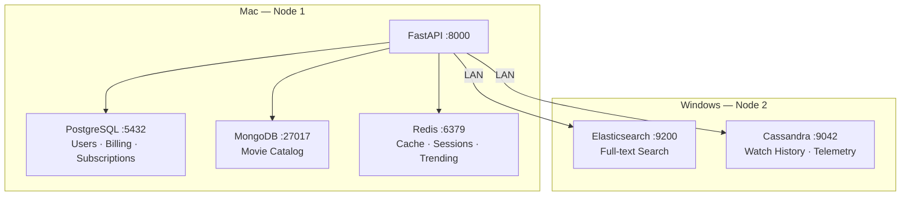
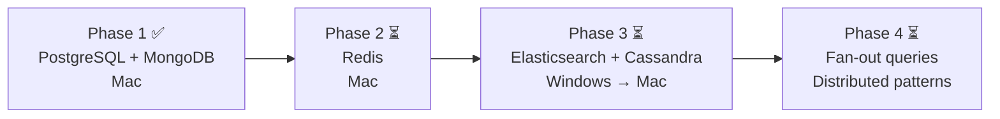

# Netflix Polyglot Persistence Backend

A learning project that builds a Netflix-style streaming backend across two physical machines, using five databases — each picked for a specific reason rooted in data structure and access pattern, not trend.

---

## What this is

Most courses use one database for everything. Production systems don't. This project implements **Polyglot Persistence**: each data domain lives in the engine that fits it mathematically.

- Billing can't be eventually consistent — ACID or nothing
- A movie catalog has no fixed schema — documents fit better than rows
- Full-text search needs inverted indexes, not `LIKE` queries
- Telemetry at scale needs LSM-tree write paths, not B-tree page splits
- Sessions need RAM, not disk

---

## Architecture



### Why each database

| Domain | Engine | Reason |
|---|---|---|
| Users, Billing, Subscriptions | PostgreSQL 16 | ACID — a charge cannot be half-applied |
| Movie Catalog | MongoDB 7 | Schema heterogeneity — series and documentaries have different shapes |
| Full-text Search | Elasticsearch 8 | Inverted index — O(1) term lookup vs O(n) table scan |
| Watch History, Telemetry | Cassandra 4 | LSM-tree — random writes become sequential disk I/O |
| Cache, Sessions, Trending | Redis 7 | Everything in RAM, no lock contention |

---

## Project Phases



**Phase 1 (done):** Async CRUD over PostgreSQL and MongoDB. ACID subscription transaction, document catalog with flexible schema, Docker Compose with health checks.

**Phase 2:** Redis — cache-aside pattern, TTL invalidation, sorted sets for trending lists.

**Phase 3:** Elasticsearch fuzzy search and autocomplete on Windows. Cassandra write-heavy telemetry. Cross-machine LAN communication.

**Phase 4:** Fan-out queries across 3+ databases per request. Saga pattern for distributed transactions. Observability and load testing.

---

## Distributed Systems Concepts

| Concept | Phase | Status |
|---|---|---|
| Failure isolation between databases | 1 | ✅ |
| Connection pool behavior under load | 1 | ✅ |
| Cache-aside pattern | 2 | ⏳ |
| TTL and cache invalidation | 2 | ⏳ |
| Inverted index vs B-tree | 3 | ⏳ |
| LSM-tree vs B-tree write paths | 3 | ⏳ |
| Cross-machine LAN cluster | 3 | ⏳ |
| Cassandra replication factor | 3 | ⏳ |
| CAP theorem in practice | 3 | ⏳ |
| Network partition simulation | 3 | ⏳ |
| Saga pattern | 4 | ⏳ |
| Fan-out query pattern | 4 | ⏳ |

---

## Setup (Phase 1)

**Prerequisites:** Docker Desktop, Python 3.12+, [uv](https://docs.astral.sh/uv/)

```bash
git clone https://github.com/devrahulbanjara/netflix-polygot.git
cd netflix-polygot

# Start PostgreSQL and MongoDB
docker compose up -d
docker compose ps   # wait until both show "healthy"

# Install dependencies
uv sync

# Run the API
uv run fastapi dev app/main.py
```

Docs at `http://localhost:8000/docs`

---

## Project Structure

```
netflix-polygot/
├── docker-compose.yml          # PostgreSQL 16 + MongoDB 7
├── init/
│   ├── postgres/
│   │   └── 01_schema.sql       # users, subscriptions, billing_events
│   └── mongo/
│       └── 01_seed.js          # movie catalog seed + indexes
├── pyproject.toml              # uv project manifest
└── app/
    ├── main.py                 # FastAPI app + lifespan
    ├── config.py               # pydantic-settings
    ├── database.py             # asyncpg pool + motor client
    ├── models/
    │   ├── user.py
    │   └── movie.py
    └── routers/
        ├── users.py            # CRUD + ACID subscription transaction
        └── movies.py           # CRUD + genre filter
```

---

## Stack

- Python 3.12, FastAPI 0.136, Pydantic v2
- asyncpg 0.31 (PostgreSQL), Motor 3.7 (MongoDB)
- PostgreSQL 16, MongoDB 7, Redis 7, Elasticsearch 8, Cassandra 4
- Docker Compose, uv

---

## References

- [Designing Data-Intensive Applications — Kleppmann](https://dataintensive.net/)
- [PostgreSQL transaction isolation](https://www.postgresql.org/docs/current/transaction-iso.html)
- [MongoDB schema design patterns](https://www.mongodb.com/developer/products/mongodb/schema-design-anti-pattern-summary/)
- [Cassandra storage engine (LSM trees)](https://cassandra.apache.org/doc/latest/cassandra/architecture/storage-engine.html)
- [Elasticsearch from the bottom up](https://www.elastic.co/blog/found-elasticsearch-from-the-bottom-up)
- [Please stop calling databases CP or AP — Kleppmann](https://martin.kleppmann.com/2015/05/11/please-stop-calling-databases-cp-or-ap.html)
